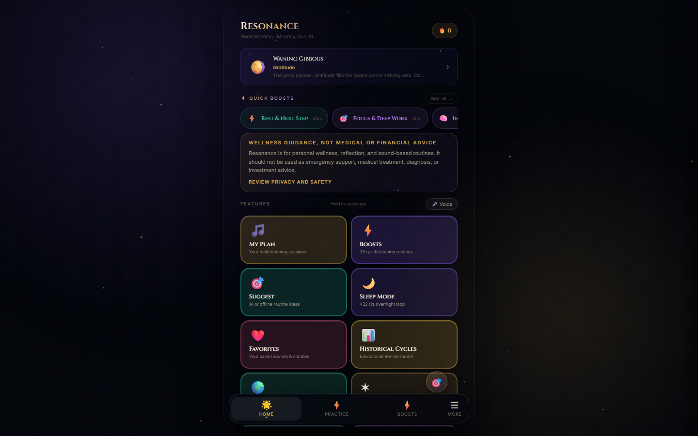
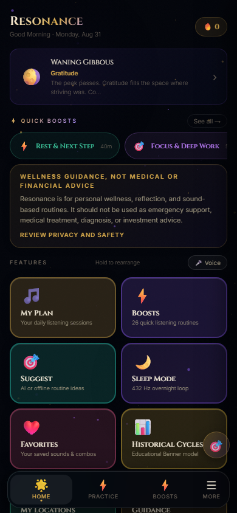
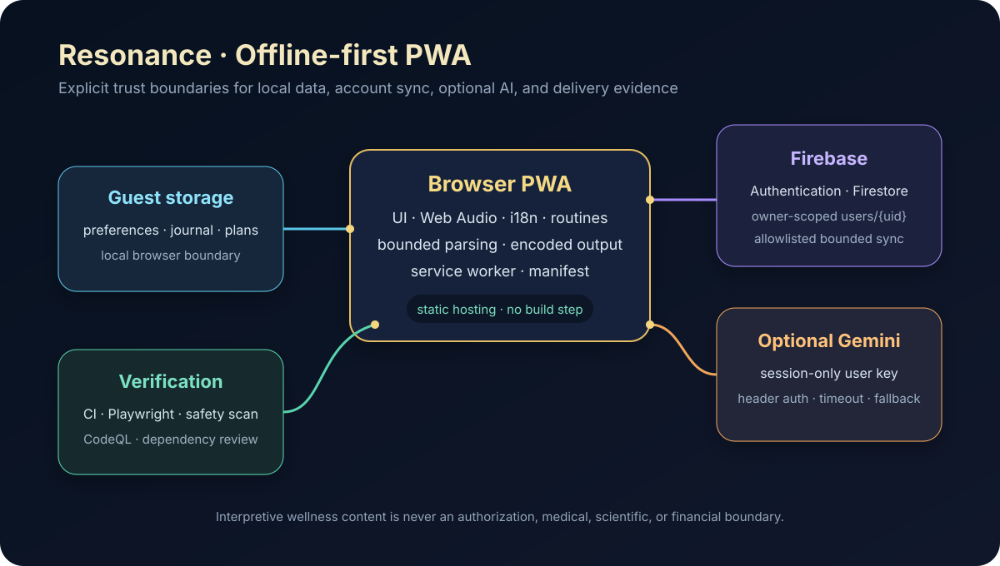

# Resonance

Offline-first, multilingual wellness PWA built with browser-native APIs,
Firebase account sync, deterministic safety checks, and real mobile browser
verification.

**Live demo:** [resonance-wellness-pwa.vercel.app](https://resonance-wellness-pwa.vercel.app)

> Resonance is a reflection and listening tool—not medical treatment,
> diagnosis, emergency support, financial advice, or a source of guaranteed
> outcomes. Frequency, astrology, lunar, and historical-cycle associations are
> presented as interpretive traditions and product themes rather than science.

## Engineering evidence

| Area | Evidence |
|---|---|
| Offline-first UX | Installable manifest, service-worker app-shell cache, guest-mode local storage |
| Browser APIs | Web Audio playback, optional speech controls, notifications, responsive PWA shell |
| Account data | Firebase-ready authentication and owner-scoped `users/{uid}` Firestore sync |
| AI fallback | Optional Gemini suggestion flow with session-only key handling and deterministic offline recommendations |
| Internationalization | English, Spanish, French, Arabic/RTL, Portuguese, and Chinese UI dictionaries |
| Quality | Content assertions, security invariants, Playwright feature smoke tests, four-viewport stress checks |
| Delivery | GitHub Actions, CodeQL, dependency review, Dependabot, Vercel/Netlify-compatible static hosting |

See [Release Evidence](docs/RELEASE_EVIDENCE.md) for the exact privacy,
dependency, browser, deployment, and repository-history gates used for the
public showcase.

## Product walkthrough

Resonance combines timed tone playback, configurable routines, favorites,
journaling, reminders, themes, multilingual navigation, and optional
tradition-based lunar/zodiac reflection. Guest data remains in the current
browser. Signed-in users may sync allowlisted application state to their own
Firestore document.

The optional Gemini mode is deliberately constrained:

- the key is stored in `sessionStorage`, not durable local storage;
- the key is sent in the `x-goog-api-key` header, never the request URL;
- input, output, duration, and frequency choices are bounded;
- requests time out and fall back to the offline recommender;
- generated text is encoded before HTML rendering;
- prompts prohibit medical, biological, financial, and guaranteed-outcome claims.

## Responsive interface

The screenshots below are generated from a clean synthetic guest session.



<p align="center">
  
</p>

## Architecture



The production app intentionally has no framework build step. The tradeoff is
explicit: deployment is simple and offline behavior is easy to inspect, while
the large single-file application remains a maintainability constraint.

See [the architecture notes](docs/ARCHITECTURE.md) for data boundaries,
security decisions, and limitations.

## Run locally

Requirements: Node.js 24+ and a Chromium-compatible browser.

```bash
npm ci
npm test
npm run test:smoke
npm run test:stress
```

The browser scripts start a loopback-only static server automatically. The
public showcase runs in guest mode and does not include a live Firebase project
configuration. A self-hosted account flow requires runtime-injected Firebase
client configuration, an authorized domain, and separately deployed and tested
Firestore rules. Core functionality does not require an account or AI key.

## Verification matrix

```bash
npm audit
npm run validate:content
npm run test:security
npm run test:smoke
npm run test:stress
python scripts/repository-safety.py --self-test
python scripts/repository-safety.py --current
python scripts/repository-safety.py --history
```

CI repeats the dependency, content, security, privacy/history, and browser-smoke
gates on every pull request. CodeQL and dependency review provide independent
security coverage.

## Privacy and safety

- Journal entries, reminders, preferences, and birth inputs can be sensitive;
  birth inputs are not stored or synced.
- Guest data stays in browser storage unless the user signs in and syncs.
- Firebase rules restrict each account to its own allowlisted user document.
- Gemini keys are never synced to Firestore and last only for the current tab.
- No owner legal name, personal contact information, production user data, or
  committed AI credential belongs in this public showcase.

Read [Privacy & Safety](docs/PRIVACY_AND_SAFETY.md) and [Security](SECURITY.md)
before changing authentication, storage, rendering, or external integrations.

## Known limitations

- Most application code and styles remain in one large HTML file.
- Firebase client identifiers are public by design; authorization depends on
  Firebase Auth and deployed Firestore rules, not secrecy of the browser config.
- A static browser app cannot protect a user-supplied AI key like a server-side
  proxy can; session-only handling reduces persistence but does not make the key
  inaccessible to code running in the same page.
- Interpretive content is not evidence of clinical efficacy or predictive power.
- Deployment security depends on keeping host headers and Firebase authorized
  domains synchronized with the canonical production URL.

## License

MIT. See [LICENSE](LICENSE).
